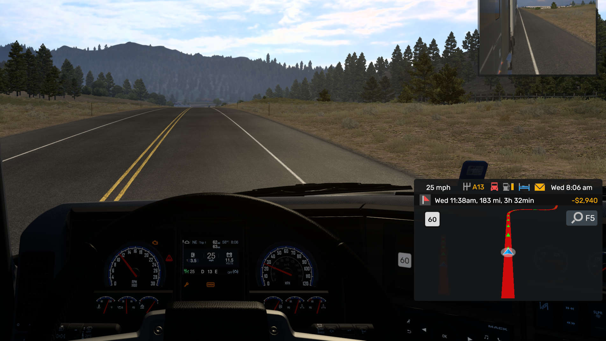

# ATS/ETS2 Dashboard

## Into

Decided to start learning electronics as a hobby and while studying got an idea to create a mini dashboard for displaying American Truck Simulator and Euro Truck Simulator 2 info. The game info (speed, cruise speed, gear, engine status, parking break status, etc...) is streamed from a companion app via usb port to the Pico which displays it on the LCD. The buttons allow to switch the displayed info on each line respectively.

This is a hobby project in a very early stage (simple) and work in progress. I intend on switching to a graphic screen and add more features/info to the dashboard.

For sending data from the game SDK to the Raspberry Pi Pico via usb I'm using a [companion app](https://github.com/gpadilha/scs-pico-dashboard-companion).

### Credits

-   [Dave Hylands](https://github.com/dhylands) for the basic [api and lcd driver code](https://github.com/dhylands/python_lcd/tree/master/lcd)
-   [Tyler Peppy](https://github.com/T-622) for the api [implementation for Pico](https://github.com/T-622/RPI-PICO-I2C-LCD)

## Usage

1. Make sure your Pico is running MicroPython. Download and installation instructions can be found [here](https://micropython.org/download/RPI_PICO/).
2. Follow the wiring of the sketch in the section below and upload the python files to Pico.

It can also be done via [Thonny IDE](https://thonny.org/)

## Hardware

-   Raspberry Pi Pico
-   LCD1602 with an I2C module
-   2 buttons
-   2 10KΩ resistors
-   Wires

## Demo

Pressing buttons to change displayed info (speed is static due to cruise control)

Game screenshot

